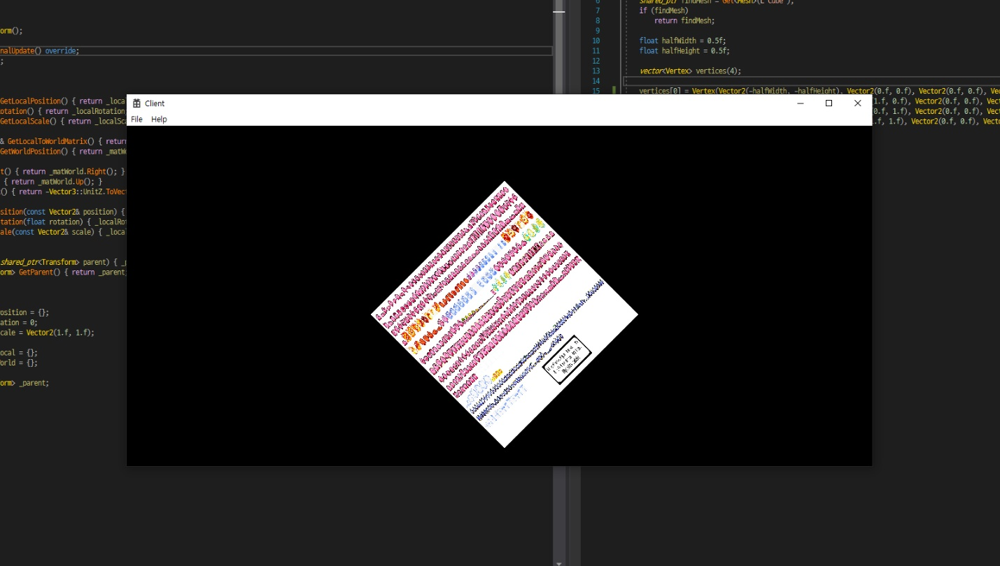

# Game Engine
### '이득우의 게임 수학', rookiss님의 인프런 강좌를 수강한 후 배운 내용들을 조합하여 만든 게임 엔진입니다.
 

## Main Contents
- Windows API를 사용하여 Direct X의 작동 흐름과 유사한 Graphics 처리를 하도록 구조를 만들었습니다.
- Unity의 구조를 따라 Engine이 작동하도록 만들었습니다. (Object, GameObject, Component, MeshRenderer 등의 클래스와 상속 관계, Start, Update 등의 멤버 함수)

### Completed tasks
- Build Engine structure
- 2D Graphics with Windows API
- Generate objects using scene files.
- Make meta file for resources used in games

### Being processed
- Convert to 3D
- Make Scene file
- Read data from meta file and use it for scenes

### ScreenShot

